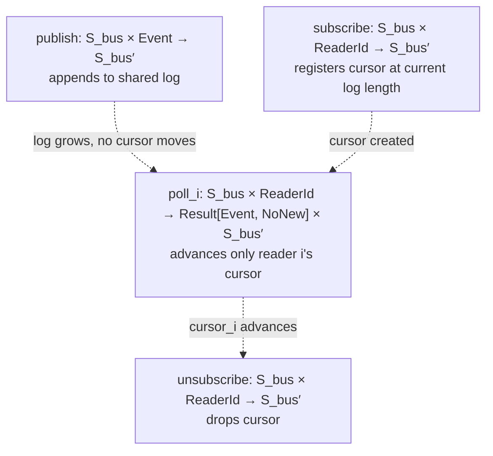

## `map_ok` vs `bind` — when each applies, using your own `CommandQueueManager`

The rule: use `map_ok` when your next step is a plain function ($T \to U$) that **cannot fail**; use `bind` when your next step is itself a `Result`-producing operation ($T \to \text{Result}[U,E]$) — chaining two possibly-failing steps.

```python
# map_ok — f can't fail, just reshapes the success value
result: Result[Command, QueueEmpty] = CommandQueueManager.dequeue(state)
payload: Result[dict, QueueEmpty] = map_ok(
    result, lambda cmd: cmd.to_dispatch_payload()
)
# QueueEmpty passes through untouched if dequeue failed; to_dispatch_payload only runs on Ok


# bind — the next step can ALSO fail, so it must return a Result itself
def validate(cmd: Command) -> Result[Command, ValidationError]:
    return Ok(cmd) if cmd.args else Err(ValidationError("missing args"))


result: Result[Command, QueueEmpty] = CommandQueueManager.dequeue(state)
validated: Result[Command, QueueEmpty | ValidationError] = bind(result, validate)
# if dequeue failed -> QueueEmpty propagates, validate never runs
# if dequeue succeeded but validate fails -> ValidationError propagates
# only if both succeed do you get Ok(cmd)
```

Chained, this is the whole value of the monad — no nested `if`:

```python
outcome = bind(
    bind(CommandQueueManager.dequeue(state), validate),
    lambda cmd: dispatcher.send(cmd),  # also Result-returning
)
match outcome:
    case Ok(value=v):
        ...
    case Err(error=e):
        ...  # e is QueueEmpty | ValidationError | DispatchError — the accumulated coproduct
```

## Command queue vs event bus — the actual structural difference

Both look like "a container of things arriving over time," but the *consumption* morphism is fundamentally different, and that difference is the whole design decision:

$$\text{dequeue} : S_{cmd} \times \text{Consumer} \to \text{Result}[\text{Command}, \text{QueueEmpty}] \times S_{cmd}' \qquad \text{(destructive — the item is removed from the carrier)}$$

$$\text{poll}_i : S_{bus} \times \text{Reader}_i \to \text{Result}[\text{Event}, \text{NoNew}] \times S_{bus}' \qquad \text{(non-destructive — only reader } i\text{'s cursor advances)}$$

A command is an **imperative addressed to exactly one executor** — "do this" — so it's correct for it to disappear once claimed; that's what makes it a queue (linear resource, single consumption). An event is a **fact that already happened**, broadcast to however many parties care — "this occurred" — so multiple independent subscribers each need to read it at their own pace without affecting each other. Removing it after one subscriber reads it would be a bug, not an optimization.

## Session morphisms on the event bus



Set-theoretically: the log is one shared carrier $L$; each reader's position is an *independent projection* $c_i : \mathbb{N}$ into $L$. `poll_i` only ever mutates $c_i$, never $L$ itself and never any other $c_j$ — that non-interference between readers is the entire point of a bus, and it's the thing a plain queue's single shared consumption pointer can't give you.

## Data structure for `EventBusState`

```python
from collections import deque


@dataclass
class EventBusState:
    log: deque[Event]  # append-only, shared
    cursors: dict[str, int]  # reader_id -> index of next unread event
```

`log` as a `deque` (not a `list`) because `publish` is always append-right, $O(1)$. `cursors` as a `dict` because reader count and identity are dynamic — subscribers come and go. This is the **log + independent cursors** model (Kafka-shaped): it supports replay, multiple consumers at different speeds, and history inspection, at the cost of unbounded growth — worth pairing with a trim step that drops entries before $\min_i(c_i)$ once you decide old, fully-read events can go.

The alternative — `dict[EventType, list[Callable]]`, publish synchronously invokes every registered handler immediately, no log at all — is simpler and fine if you never need replay or differing consumption rates, but it's a different morphism entirely: `publish` there *is* the fan-out (a coproduct of side effects), not a pure append. Do you need replay/backpressure (multiple consumers reading at different rates, or reconnecting subscribers catching up), or is synchronous immediate dispatch actually enough for what `EventBusState` needs to do?