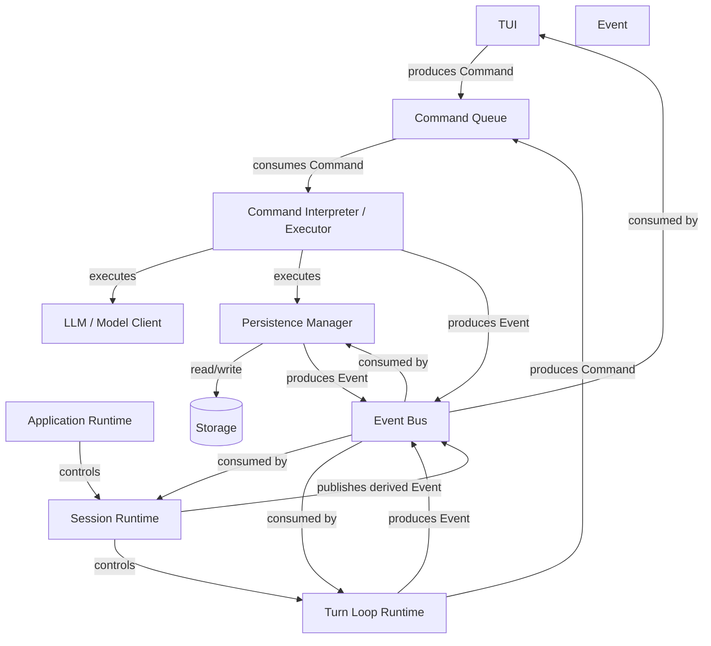

**Intent: architectural producer/consumer topology** — showing the control plane around your command queue and event bus.

The important asymmetry is:

$$
\boxed{
\mathrm{CommandQueue}:
\text{intent transport}
}
$$

while:

$$
\boxed{
\mathrm{EventBus}:
\text{fact distribution}
}
$$

So the main flows are:

$$
\boxed{
\begin{aligned}
\mathrm{TUI}
&\rightarrow C_Q\
\mathrm{TurnLoop}
&\rightarrow C_Q\
C_Q
&\rightarrow \mathrm{CommandExecutor}\
\mathrm{CommandExecutor}
&\rightarrow E_B\
\mathrm{TurnLoop}
&\rightarrow E_B\
E_B
&\rightarrow \mathrm{TUI}\
E_B
&\rightarrow \mathrm{SessionRuntime}\
E_B
&\rightarrow \mathrm{Persistence}
\end{aligned}}
$$

One refinement: **I would make `SessionRuntime` the coordinator rather than a direct producer of commands.** Its job is primarily to consume events, invoke/coordinate the turn runtime, and update session state.

So the hierarchy is:

$$
\boxed{
\mathrm{ApplicationRuntime}
\rightarrow
\mathrm{SessionRuntime}
\rightarrow
\mathrm{TurnLoopRuntime}
}
$$

while the two communication planes cut *across* that hierarchy:

$$
\boxed{
\begin{aligned}
\text{producers} &\rightarrow \mathrm{CommandQueue}\rightarrow\text{executor}\
\text{executor} &\rightarrow \mathrm{EventBus}\rightarrow\text{consumers}
\end{aligned}}
$$

This gives you a useful dependency rule: **children don't need references to sibling components; they only need the capability to submit commands or subscribe/consume events.**
