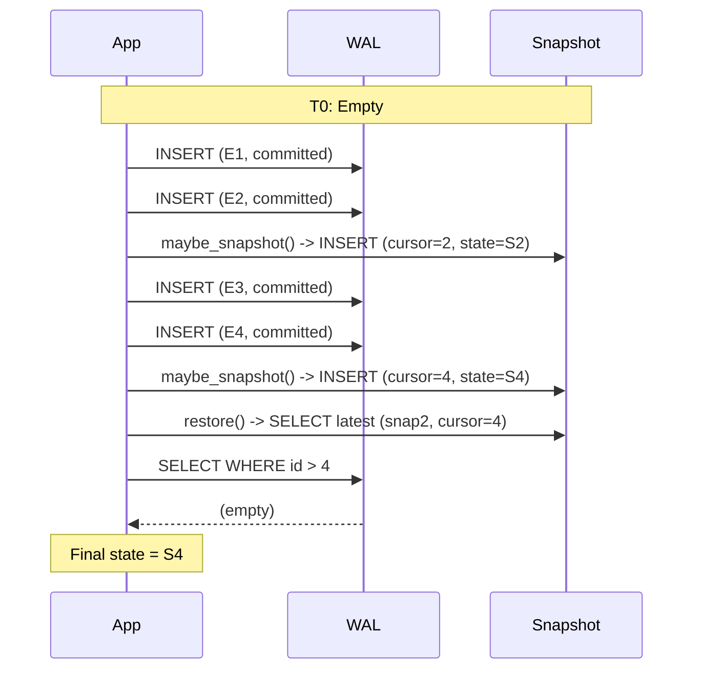

Perfect – you want to see **how the actual data inside the tables evolves over time**, step by step, rather than just the function-call flow.

Below is a **temporal Mermaid diagram** that visualises the WAL and Snapshot tables at each stage, from an empty database through appends, snapshot triggers, and finally a restore.

---

## Viz 1

[DeepSeek WAL Snapshot Temporal](assets/deepseek_WAL-Snapshot-temporal.svg)

📦 **The Five Logical Phases**

| Box | Time Range      | Phase Name                 | Description                                                                                                                             |
|-----|-----------------|---------------------------|-----------------------------------------------------------------------------------------------------------------------------------------|
| 1   | t = 0           | Initialization            | The database is created. Both the WAL and Snapshot tables are empty. The in-memory state is at its initial value (S0).                  |
| 2   | t = 1 → t = 2   | First Catch-up            | Events A and B (both "committed") are appended. The WAL contains [1, 2]. The Snapshot table is still empty because the threshold (`snapshot_every = 2`) has just been reached—no snapshot yet (it triggers *after* these appends). State advances to S2. |
| 3   | t = 3           | First Checkpoint          | `maybe_snapshot()` runs, detects count ≥ 2, and creates the first snapshot (snap1). It records `wal_cursor = 2` and persists current state S2. The WAL remains unchanged. State is still S2. |
| 4   | t = 4 → t = 5   | Second Catch-up           | Events C and D are appended to the WAL, expanding it to [1, 2, 3, 4]. The Snapshot table still only contains snap1. State advances to S4. |
| 5   | t = 6 → t = 7   | Second Checkpoint & Restore | At t=6, `maybe_snapshot()` triggers again (WAL rows 3 & 4 are new), creating snap2 with `wal_cursor = 4` and state S4. At t=7, `restore()` loads snap2, finds no WAL rows after id=4, and completes with final state S4. |

---

## 📈 Temporal Visualization: WAL & Snapshot Evolution Over Time

This diagram shows the **exact contents** of the `wal` and `snapshot` tables *before* and *after* each key operation.

```mermaid
flowchart LR
    subgraph T0["⏱️ T0: Initial (Constructor)"]
        direction TB
        W0["📋 WAL table: <br/> (empty)"]
        S0["💾 Snapshot table: <br/> (empty)"]
        R0["🧠 In-memory State: <br/> Initial S0"]
    end

    subgraph T1["⏱️ T1: Append(Event A, committed)"]
        direction TB
        W1["📋 WAL table: <br/> ┌────┬───────────┐<br/> │ id │ kind      │<br/> ├────┼───────────┤<br/> │ 1  │ committed │<br/> └────┴───────────┘"]
        S1["💾 Snapshot table: <br/> (empty)"]
        R1["🧠 State: S1 (after applying A)"]
    end

    subgraph T2["⏱️ T2: Append(Event B, committed)"]
        direction TB
        W2["📋 WAL table: <br/> ┌────┬───────────┐<br/> │ id │ kind      │<br/> ├────┼───────────┤<br/> │ 1  │ committed │<br/> │ 2  │ committed │<br/> └────┴───────────┘"]
        S2["💾 Snapshot table: <br/> (empty)"]
        R2["🧠 State: S2 (after applying B)"]
    end

    subgraph T3["⏱️ T3: maybe_snapshot(threshold=2)"]
        direction TB
        W3["📋 WAL table: <br/> (unchanged, still 1, 2)"]
        S3["💾 Snapshot table: <br/> ┌─────┬─────────────┬──────────┐<br/> │ id  │ wal_cursor  │ state    │<br/> ├─────┼─────────────┼──────────┤<br/> │ 1   │ 2           │ JSON(S2) │<br/> └─────┴─────────────┴──────────┘"]
        R3["🧠 State: S2 (no change)"]
    end

    subgraph T4["⏱️ T4: Append(Event C, committed)"]
        direction TB
        W4["📋 WAL table: <br/> ┌────┬───────────┐<br/> │ id │ kind      │<br/> ├────┼───────────┤<br/> │ 1  │ committed │<br/> │ 2  │ committed │<br/> │ 3  │ committed │<br/> └────┴───────────┘"]
        S4["💾 Snapshot table: <br/> (still only snap1, cursor=2)"]
        R4["🧠 State: S3 (after applying C)"]
    end

    subgraph T5["⏱️ T5: Append(Event D, committed)"]
        direction TB
        W5["📋 WAL table: <br/> ┌────┬───────────┐<br/> │ id │ kind      │<br/> ├────┼───────────┤<br/> │ 1  │ committed │<br/> │ 2  │ committed │<br/> │ 3  │ committed │<br/> │ 4  │ committed │<br/> └────┴───────────┘"]
        S5["💾 Snapshot table: <br/> (still only snap1, cursor=2)"]
        R5["🧠 State: S4 (after applying D)"]
    end

    subgraph T6["⏱️ T6: maybe_snapshot(threshold=2) again"]
        direction TB
        W6["📋 WAL table: <br/> (unchanged, still 1–4)"]
        S6["💾 Snapshot table: <br/> ┌─────┬─────────────┬──────────┐<br/> │ id  │ wal_cursor  │ state    │<br/> ├─────┼─────────────┼──────────┤<br/> │ 1   │ 2           │ JSON(S2) │<br/> │ 2   │ 4           │ JSON(S4) │<br/> └─────┴─────────────┴──────────┘"]
        R6["🧠 State: S4 (no change)"]
    end

    subgraph T7["⏱️ T7: restore() – loads latest snapshot"]
        direction TB
        W7["📋 WAL table: <br/> (unchanged, 1–4)"]
        S7["💾 Snapshot table: <br/> (same as T6)"]
        R7["🧠 restore() picks snap2 (cursor=4, state=S4). <br/> Then replays WAL where id > 4 → (none). <br/> ✅ Final restored state = S4"]
    end

    T0 --> T1 --> T2 --> T3 --> T4 --> T5 --> T6 --> T7
```

---

## 🧩 What This Visualisation Shows (Before & After)

| Stage  | Operation                          | WAL Table   | Snapshot Table                                        | What happens to State                                           |
| ------ | ---------------------------------- | ----------- | ----------------------------------------------------- | --------------------------------------------------------------- |
| **T0** | Constructor                        | Empty       | Empty                                                 | Initial state (S0)                                              |
| **T1** | `append(E1)`                       | Adds `id=1` | Still empty                                           | Advances to S1                                                  |
| **T2** | `append(E2)`                       | Adds `id=2` | Still empty                                           | Advances to S2                                                  |
| **T3** | `maybe_snapshot` (count ≥ 2)       | Unchanged   | **First snapshot** is born! `wal_cursor=2`, state=S2  | State stays S2 (read‑only)                                      |
| **T4** | `append(E3)`                       | Adds `id=3` | Still only snap1                                      | Advances to S3                                                  |
| **T5** | `append(E4)`                       | Adds `id=4` | Still only snap1                                      | Advances to S4                                                  |
| **T6** | `maybe_snapshot` (count ≥ 2 again) | Unchanged   | **Second snapshot** is born! `wal_cursor=4`, state=S4 | State stays S4                                                  |
| **T7** | `restore()`                        | Unchanged   | Reads the **latest** snapshot (snap2)                 | Loads S4 directly. Since `id > 4` returns nothing, S4 is final. |

---

## ⏪ What If You Restored Earlier? (Bonus Temporal Insight)

If you called `restore()` at **T4** (right after appending C, before the second snapshot), here is what would happen:

1. `restore()` would read **snap1** (`wal_cursor=2`, state=S2).
2. It would then **replay** all WAL entries with `id > 2` – which are `id=3` (Event C).
3. After applying Event C to state S2, you get **S3** – the exact correct state at T4.

This is the **essence** of the WAL + Snapshot synergy:

- Snapshots are **checkpoints** that speed up recovery.
- The WAL guarantees **no data loss** – any events after the last snapshot are simply replayed.

---

## 🔄 Summary of the Interaction

This sequence diagram complements the table view by showing the **order of interactions** and how the **restore** always asks the WAL for **only the tail** after the latest snapshot cursor.

Let me know if you want me to add more stages (like non‑committed events, or a restore from an older snapshot) for even deeper understanding!