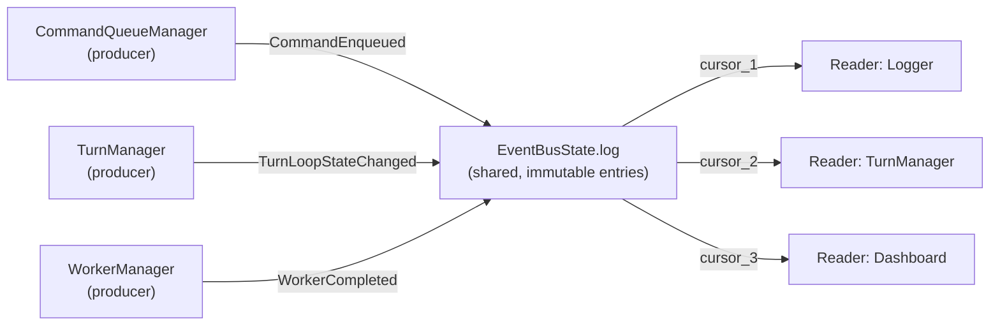

## First-principles: why immutability isn't optional here, it's *implied* by a decision you already made

Two turns ago you fixed `EventBusState.log` as one shared carrier with independent per-reader cursors — the whole reason a bus differs from a queue is that **N readers see the same entries at their own pace**. Follow that through: if `EventPayload` were mutable and reader $i$ mutated the object it just polled, reader $j$ polling the *same* log slot later would see reader $i$'s mutation — a correctness violation of the exact non-interference property that motivated the cursor design in the first place. So immutability isn't a style preference for payloads; it's **entailed by** "one carrier, many independent consumers." Any mutable payload silently reintroduces coupling between consumers that the whole bus/queue split was built to eliminate.

$$\forall i, j \in \text{Readers}: \quad \text{poll}_i(L, c_i) \text{ must not affect } \text{poll}_j(L, c_j) \quad \Rightarrow \quad L_k \text{ is invariant once appended}$$

That's `frozen=True`, but **transitively** — a `frozen` dataclass only freezes its own top-level fields; if a field is a `list` or `dict`, that container is still mutable underneath the frozen wrapper. So: `tuple` not `list`, and if `Command` (the thing a payload might carry) isn't itself frozen, you've got a hole in the guarantee.

## Structural design: `EventPayload` is a second coproduct, orthogonal to `EventBusEvent`

Don't conflate these two unions — they answer different questions. `EventBusEvent` (`Publish`/`Subscribe`/`Unsubscribe`) is *"what operation on the bus carrier"*; `EventPayload` is *"what domain fact is being broadcast."* `Publish.payload : EventPayload` is generic *precisely because* the bus shouldn't know or care what facts flow through it — so `EventPayload` itself needs to be the coproduct of every fact type any producer across the whole system might emit:

$$\text{EventPayload} = P_{cmd} + P_{agent} + P_{worker} + P_{conv}$$



Each variant carries **facts, not handles**: primitives and ids, never a live reference into a mutable state carrier. This is the concrete rule that follows from the transitive-immutability point above — even if you *could* freeze `Command`, embedding the live `Command` object means every reader is now coupled to `Command`'s schema and lifetime; embedding `command_id: str` means readers who care can look it up (from wherever the authoritative copy lives), and readers who don't care aren't dragged into a dependency they never needed.

```python
@dataclass(frozen=True)
class CommandEnqueued:
    command_id: str
    command_kind: (
        str  # e.g. "shell", "http" — enough to route without importing Command
    )


@dataclass(frozen=True)
class TurnLoopStateChanged:
    previous: (
        str  # "Idle" / "Running" / "Error" — the tag, not the TurnLoopState object
    )
    current: str


@dataclass(frozen=True)
class WorkerCompleted:
    worker_id: str
    result_ref: str  # a lookup key, not the raw result payload


EventPayload = Union[CommandEnqueued, TurnLoopStateChanged, WorkerCompleted]
```

## Producer/consumer contract — what each side is allowed to assume

**Producers** (your managers) own the *only* legitimate constructors for their slice of the coproduct — `TurnManager` is the sole author of `TurnLoopStateChanged`, the same way it's the sole author of transitions on `TurnLoopState`. This mirrors the algebra-map ownership from before: a manager owns $\delta_i$ *and* owns emission of $P_i$, because both derive from the same authority — "I am the thing that knows when this fact became true."

**Consumers** get: a `match` that's exhaustive over `EventPayload` (same `assert_never` discipline as `CommandQueueEvent`), and a guarantee that whatever they hold after `poll_i` returns is theirs forever — no aliasing risk, no need to defensively copy on read, because immutability was enforced at construction, not at the boundary.

**One field worth adding that neither producers nor consumers own outright — causal/correlation metadata.** Right now nothing threads "this `WorkerCompleted` happened *because of* that `CommandEnqueued`" — and once you have multiple producers on one shared log, that causal chain is exactly the thing you lose first and want back most (debugging, tracing, replay-to-a-point). Worth carrying a `caused_by: str | None` (an event id, from your base `Event.id`) on every payload variant, or hoisting it up as a field on `Publish` itself rather than duplicating it into every payload type — which of those two placements do you want: causal id on the envelope (`Publish`) or on each fact (`EventPayload` variant)?