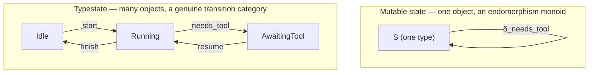

## Mutable state = a monoid acting on one set. Typestate = a small category where the states themselves are the objects.

This is the sharpest way to say it, and it's worth deriving rather than just asserting, because the difference in *where the guarantee lives* is the entire point.

**Mutable state (what your `AgentState` actually is right now).** You have one fixed set $S$ (the `Union[Idle, Running, AwaitingTool, Error]` type, treated as a single type for typing purposes), and a family of functions $\delta_e : S \to S$ (or partial, $S \rightharpoonup S$) indexed by events $e \in E$. Algebraically, this is a **monoid action**: the free monoid $E^*$ (sequences of events) acts on $S$ via $\delta$, and "the current state" is a single time-varying element $s(t) \in S$ — same type at every $t$, only the *value* changes. Category-theoretically it's a **one-object category**: object $= S$, morphisms $=$ the endomorphisms $\delta_e : S \to S$, composition $=$ chaining events. Because every morphism has the *same* domain and codomain ($S \to S$), the type system cannot distinguish "a call legal from `Idle`" from "a call legal from `Running`" — legality can only be checked **inside** the function, at runtime, which is exactly why `AgentManager.start` has to `match` on the incoming value and return `Err(IllegalTransition)` when it's the wrong variant. The guarantee ("you can't call `finish` from `Idle`") is enforced by a value inspected at call time, not by anything the compiler refuses to typecheck.

**Typestate.** Instead of one set $S$ with an internal tag, you have a genuinely **indexed family of distinct types** $\{S_i\}_{i \in I}$ — `Idle`, `Running`, `AwaitingTool`, `Error` as four unrelated types, not four variants of one type — and transitions are morphisms *between* objects of a small category $\mathcal{C}$ whose **object set is the state space itself**:

$$\text{Ob}(\mathcal{C}) = \{S_{Idle}, S_{Running}, S_{AwaitingTool}, S_{Error}\}, \qquad \text{Hom}_\mathcal{C}(S_{Idle}, S_{Running}) = \{\text{start}\}, \quad \text{Hom}_\mathcal{C}(S_{Idle}, S_{AwaitingTool}) = \varnothing$$

The crucial fact: $\text{Hom}_\mathcal{C}(S_{Idle}, S_{AwaitingTool}) = \varnothing$ isn't a runtime check that returns `Err` — **there is no morphism there to call.** `finish()` simply doesn't exist as a method on the `Idle` type. This is Curry–Howard doing real work: a well-typed program can only ever compose morphisms that exist in $\mathcal{C}$, so "call an illegal transition" isn't a runtime error path you have to remember to handle — it's **not a sentence in the language**, the same way `2 + "cat"` isn't a sentence in a typed arithmetic language. That's the Rust typestate sketch from earlier: `impl Idle { fn start(self, ...) -> Running }` — there is no `impl Idle { fn finish() -> Idle }`, full stop, so the illegal call is a compile error, not a matched-and-rejected value.

## Precisely what you traded, going one way or the other

| | Mutable-state (monoid on one set) | Typestate (multi-object category) |
|---|---|---|
| Illegal transition caught | at runtime, via `Result`/`match` | at compile time — inexpressible |
| Cost of a new state variant | add a `Union` member, extend every `match` | add an object + only the morphisms you define out of it |
| Uniform handling ("apply any `AgentEvent`") | trivial — one function, one domain type | awkward — no single function has type `∀i. S_i → S_j`, since $i,j$ vary |
| Fits your `Core.step: Event → Result` dispatch table | yes, directly | not directly — needs an existential wrapper (`enum AgentHandle { Idle(Idle), Running(Running), ... }`) to give `Core` one uniform type to dispatch on |

That last row is the real reason your current Python implementation is mutable-state rather than true typestate, and it isn't a mistake — it's a forced consequence of an earlier decision. `Core.step`'s dispatch table needs **one uniform type** to match on ($E_{app}$ in, `Result` out) so it can iterate a flat `Iterable[Event]`. A pure typestate `AgentState` has *no* single type — `Idle`, `Running`, etc. are genuinely unrelated types — so something still has to wrap them back into one sum for `Core` to hold in `AppState.agent : AgentState`. Rust solves this the same way (an `enum AgentHandle` wrapping the typestate structs) — so even idiomatic Rust typestate designs end up with a thin mutable-state *shell* around a typestate *core*, for exactly the reason your Python one does.

**So the honest recommendation, given what `Core` already requires:** keep `AgentState` as the `Union` (mutable-state shell, needed for uniform dispatch), but treat each `AgentManager` method's `match` arm as *emulating* the typestate morphism it should be — the discipline (one legal source variant per method, `Err` on anything else) gives you the same *logical* guarantee as typestate, just checked at runtime instead of compile time. Do you want to go further and actually push the typestate boundary down one level — e.g. `Running` and `AwaitingTool` becoming genuinely separate classes with no shared base, so `AgentManager.finish` can only be *called* on something proven at the type level to be `Running` — accepting the cost that `Core.step` then needs an extra unwrap/wrap at its boundary, or is the runtime-checked version the right tradeoff for how often `AgentState` actually needs uniform dispatch?