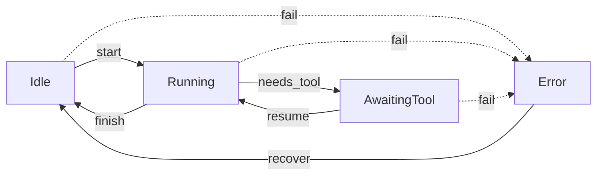

## `TurnLoopState` as a coproduct — the morphisms follow directly from its shape

From the typestate discussion, treat each variant as carrying exactly what's needed to be *in* that state, nothing more — and let each morphism's domain be dictated by which variant it's leaving from.

$$S_{agent} = \text{Idle} + \text{Running} + \text{AwaitingTool} + \text{Error}$$

```python
@dataclass(frozen=True)
class Idle:
    pass


@dataclass(frozen=True)
class Running:
    request_id: str  # handle to the in-flight LLM call — prevents double-dispatch (typestate point)


@dataclass(frozen=True)
class AwaitingTool:
    request_id: str  # the LLM turn this tool call belongs to
    pending_tool_call: str  # id of the ToolCall dispatched to WorkerManager


@dataclass(frozen=True)
class Error:
    reason: str
    recoverable: bool


TurnLoopState = Union[Idle, Running, AwaitingTool, Error]
```

## The morphisms — one per legal edge, no more

$$\text{Idle} \xrightarrow{\text{start}} \text{Running} \xrightarrow{\text{needs\_tool}} \text{AwaitingTool} \xrightarrow{\text{resume}} \text{Running} \xrightarrow{\text{finish}} \text{Idle}$$

with `fail` as an edge from every state into `Error`, and `recover` as the one edge out.



**Why `needs_tool` and `finish` are two separate morphisms out of `Running`, not one branching morphism.** A completion from the LLM is genuinely one of two disjoint shapes — "here's a tool call to make" or "here's the final answer" — so this is itself a coproduct decision, and giving it two morphism names (rather than one `on_completion` that internally branches) keeps each morphism's postcondition singular: `needs_tool`'s postcondition is always `AwaitingTool`, `finish`'s is always `Idle`. A single branching morphism would have a *disjunctive* postcondition, which is exactly the kind of ambiguity the seL4-style discipline flagged earlier — every primitive should have one determinate outcome, not "outcome depends on content you have to re-inspect downstream."

```python
class TurnManager:
    @staticmethod
    def start(
        state: TurnLoopState, bus: EventBusState, request_id: str
    ) -> Result[TurnLoopState, IllegalTransition]:
        match state:
            case Idle():
                new = Running(request_id=request_id)
                TurnManager._announce(bus, "Idle", "Running")
                return Ok(new)
            case _:
                return Err(
                    IllegalTransition(
                        f"start requires Idle, got {type(state).__name__}"
                    )
                )

    @staticmethod
    def needs_tool(
        state: TurnLoopState, bus: EventBusState, tool_call_id: str
    ) -> Result[TurnLoopState, IllegalTransition]:
        match state:
            case Running(request_id=rid):
                new = AwaitingTool(request_id=rid, pending_tool_call=tool_call_id)
                TurnManager._announce(bus, "Running", "AwaitingTool")
                return Ok(new)
            case _:
                return Err(
                    IllegalTransition(
                        f"needs_tool requires Running, got {type(state).__name__}"
                    )
                )

    @staticmethod
    def resume(
        state: TurnLoopState, bus: EventBusState
    ) -> Result[TurnLoopState, IllegalTransition]:
        match state:
            case AwaitingTool(request_id=rid):
                new = Running(request_id=rid)
                TurnManager._announce(bus, "AwaitingTool", "Running")
                return Ok(new)
            case _:
                return Err(
                    IllegalTransition(
                        f"resume requires AwaitingTool, got {type(state).__name__}"
                    )
                )

    @staticmethod
    def finish(
        state: TurnLoopState, bus: EventBusState
    ) -> Result[TurnLoopState, IllegalTransition]:
        match state:
            case Running():
                TurnManager._announce(bus, "Running", "Idle")
                return Ok(Idle())
            case _:
                return Err(
                    IllegalTransition(
                        f"finish requires Running, got {type(state).__name__}"
                    )
                )

    @staticmethod
    def fail(
        state: TurnLoopState, bus: EventBusState, reason: str, recoverable: bool
    ) -> TurnLoopState:
        TurnManager._announce(bus, type(state).__name__, "Error")
        return Error(
            reason=reason, recoverable=recoverable
        )  # total — fail is defined from every state, so no Result

    @staticmethod
    def recover(
        state: TurnLoopState, bus: EventBusState
    ) -> Result[TurnLoopState, IllegalTransition]:
        match state:
            case Error(recoverable=True):
                TurnManager._announce(bus, "Error", "Idle")
                return Ok(Idle())
            case Error(recoverable=False):
                return Err(
                    IllegalTransition(
                        "unrecoverable error — process must restart, not recover"
                    )
                )
            case _:
                return Err(
                    IllegalTransition(
                        f"recover requires Error, got {type(state).__name__}"
                    )
                )

    @staticmethod
    def _announce(bus: EventBusState, previous: str, current: str) -> None:
        EventBusManager.apply(
            bus,
            Publish(payload=TurnLoopStateChanged(previous=previous, current=current)),
        )
```

**Why `fail` alone is total (no `Result`) while every other morphism is partial.** This is deliberate, not an inconsistency: `fail`'s precondition is "the agent exists in *any* state," which is vacuously true — there's no illegal source state for a failure edge, since anything can go wrong from anywhere. Making the other five partial and this one total is the type system telling you, correctly, that error-handling is the one thing you don't need to guard against misuse.

## The event coproduct — one summand per morphism that's externally triggerable

```python
@dataclass(frozen=True)
class Start(Event):
    request_id: str
    prompt: str


@dataclass(frozen=True)
class CompletionReceived(Event):
    request_id: str
    tool_call_id: (
        str | None
    )  # None ⇒ finish; present ⇒ needs_tool — the disjointness lives in the data, not a flag


@dataclass(frozen=True)
class ToolResultReceived(Event):
    request_id: str
    result_ref: str


@dataclass(frozen=True)
class Failed(Event):
    reason: str
    recoverable: bool


@dataclass(frozen=True)
class Recover(Event):
    pass


AgentEvent = Union[Start, CompletionReceived, ToolResultReceived, Failed, Recover]
```

`CompletionReceived.tool_call_id` being `Optional` rather than two separate event types is the one place I'd flag as worth a second look against the "disjointness lives in the data, not a flag" principle I just used to justify `needs_tool`/`finish` as separate morphisms — an `Optional` field re-smuggles the branch back into content you inspect, rather than the type. The alternative is `CompletionReceived = ToolCallRequested(request_id, tool_call_id) | AnswerReady(request_id)` as two proper variants. Do you want that split, or is `Optional` acceptable here specifically because `CompletionReceived` is a single wire message from the LLM adapter and splitting it would just move the branch from `apply`'s `match` into the adapter's parsing code?