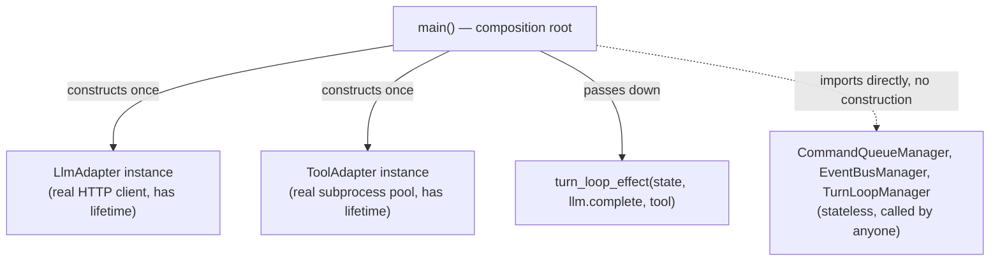

## 1. Should `poll` be an `EventBusEvent`? Still no — and now you have language for exactly why

Nothing has changed since that decision: $E_{bus}$ is the domain of the **fold** — broadcast writes to the shared carrier that every consumer of the stream needs to agree happened, in order. `poll_i` is a **per-reader query**, and its result depends on *who's asking* ($c_i$) — it has no well-defined effect on `S_bus` as a whole. If you put it in the coproduct, `Session`'s fold would need to know *which reader* is polling to interpret the event, which breaks the fold's whole premise: one event, one deterministic effect on the shared state, independent of who "caused" it to be processed. Keep `poll` as a direct method call (`EventBusManager.poll(bus, reader_id)`), not a member of $E_{bus}$.

## 2. Dependency inversion in a functional setting — this already exists in your code, it just doesn't look like DI because DI-the-word comes loaded with OOP baggage

**The OOP version of DI solves a problem you don't have.** Spring/Guice-style containers exist because OOP objects have *identity and lifetime* — a `UserService` needs *a* `Repository` instance, constructed once, injected at construction, because the object holds state across calls. The container's whole job is resolving an object graph and managing instance lifetimes (singleton/transient/scoped).

**Your managers have no lifetime, because they hold no state.** `CommandQueueManager`, `EventBusManager`, `TurnLoopManager` are pure namespaces of `@staticmethod`s — there is nothing to construct, nothing to inject, no lifetime to manage, because there is no *instance*. This is the actual resolution to your confusion: you're trying to apply a solution (a DI container/registry of constructed objects) to a problem that dissolved the moment managers stopped owning state. A stateless function can be called from anywhere, by anyone, simultaneously, with zero coordination — that's *why* it's safe for both `tui_loop` and `Session` to call `EventBusManager.apply` directly, no injection needed at all. The only thing being "shared" is a module import, same as importing `math`.

**What functional DI actually looks like — this is the Reader-monad / environment-passing pattern**, and you've already been doing it: `turn_loop_effect(state, agent, tool)` takes its dependencies as *plain arguments*, not as constructor-injected fields. "Inversion" in this style means: the pure core is parameterized over *what it needs* ($\text{Callable}$, $\text{ToolAdapter}$ — abstractions) rather than importing concrete adapters directly; the *caller* decides which concrete instance to pass, at the call site closest to the composition root. No container resolves a graph — the graph *is* the call stack.



**The precedent worth citing, because it's the closest existing thing to your exact rule ("never init with state for functional classes"):** JAX-family ML frameworks (Flax, Haiku) enforce precisely this split. `model.apply(params, x)` — `params` (the actual weights, the state) is threaded explicitly through every call; the `model` object itself is stateless, holds no weights, and can be called concurrently from anywhere with different `params` with zero coordination. That's your `EventBusManager.apply(state, event)` exactly — `EventBusManager` is `model`, `EventBusState` is `params`. This is also, separately, the **Elm Architecture / Redux** pattern for the effect side: `update` is a pure function returning *data describing an effect* (a `Cmd`), and a separate, singular runtime interprets those commands with real IO — same split as your `apply` (pure, returns new state + maybe an event) vs. `turn_loop_effect`/runner (impure, interprets).

## 3. `EventBusManager` used by both TUI and Session — not a problem, and here's the precise reason it isn't

Because `EventBusManager` is stateless, "used by two callers" carries **zero** of the coordination risk it would carry in OOP (no race on `self`, because there is no `self`). The thing that *does* need single ownership is `EventBusState` — the data — and you already have that right: `Session` owns the one `EventBusState` instance for the process, `tui_loop` only ever receives a **borrowed reference** to it, never constructs or owns its own copy. Manager sharing is free; carrier sharing is the only thing requiring discipline (single owner, borrow elsewhere) — which is exactly the ownership table from several turns ago, unchanged.

## 4. "Injecting managers" and lazy/recursive init — critique, with practice labels

**What you were reaching for with "inject the managers":** in the registry pattern, `Subsystem.apply` already *is* the injection point — a subsystem class declares which manager(s) it delegates to, and that binding is static (written once, in the subsystem's own body), not resolved at runtime from a container. There's no second graph to construct. If what you actually want is *swappable* managers (e.g. a `TestCommandQueueManager` for unit tests) — that's solved by **parameterizing the subsystem's `apply` with a manager argument** (same Reader-style pattern as `turn_loop_effect`), not by a DI container:

```python
def make_command_queue_subsystem(manager: type[CommandQueueManager]) -> type[Subsystem]:
    class _Sub(Subsystem):
        @staticmethod
        def owns(event): return isinstance(event, CommandQueueEvent)
        @staticmethod
        def apply(state, event): return manager.apply(state.command_queue, state.event_bus, event)
    return _Sub
```

This is **higher-order-function injection** — the standard functional substitute for a DI container, sometimes labeled *partial application as composition root* — and it only becomes worth doing the moment you actually need substitutability (tests, alternate implementations), not preemptively.

**On "start with top-level AppState, so do I need to init inner states lazily/recursively" — this is already solved, correctly, by `Bootstrap`.** Recall the very first message: `Bootstrap.run` *is* the tupling morphism $\langle f_{cmd}, f_{bus}, f_{turnloop}, f_{worker}\rangle$ — each factor's `.new()` called once, composed into the product. That already **is** the recursive construction you're describing; there's no separate "lazy inner init" problem to solve, because state construction was never coupled to manager construction in the first place (managers were never constructed at all). The one place genuine laziness is worth considering is **adapters with real external resources** — e.g. don't open the LLM client's HTTP connection until the first `Running` transition actually needs it — but that's a property of `LlmAdapter`'s own constructor (lazy-connect-on-first-use, a well-known resource pattern), not something `Bootstrap`/`AppState` construction needs to know or participate in.

**The critique, stated plainly:** the confusion is import of a mental model (OOP DI container resolving object lifetimes) into a codebase that mostly doesn't have objects with lifetimes. The fix isn't a new injection mechanism — it's recognizing the graph you're worried about constructing has exactly two real nodes with lifetimes (`LlmAdapter`, `ToolAdapter`), both constructed once in `main` (your composition root), and everything else — every manager, every subsystem — is a stateless value passed by reference, requiring no construction, no ordering, no graph resolution at all. Do `LlmAdapter`/`ToolAdapter` currently hold anything with a real lifetime (an open connection, a process pool) that would justify this composition-root treatment, or are they, too, currently stateless wrappers around a plain async HTTP call — because if the latter, even those two don't need "construction," just a config value closed over.